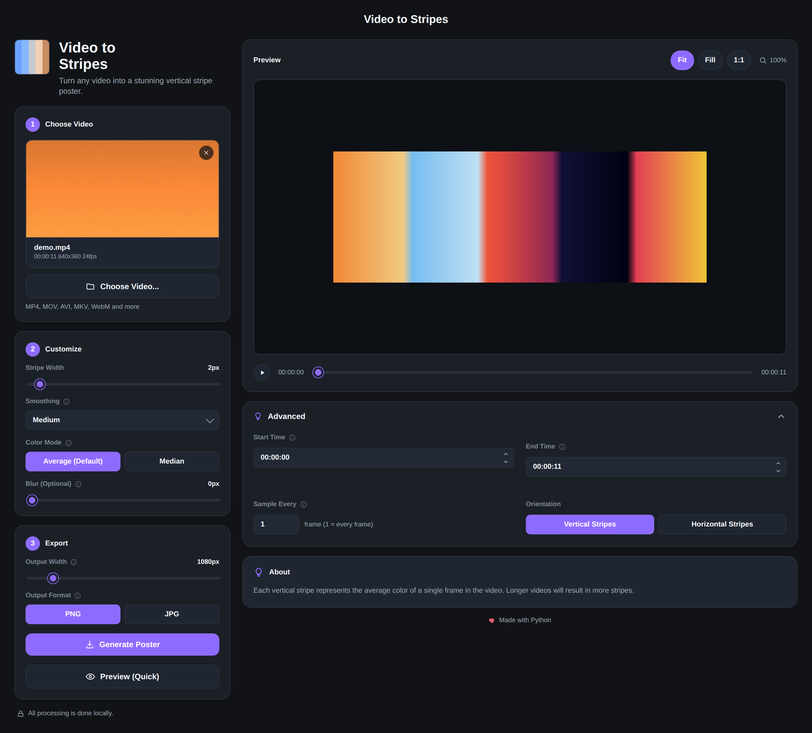

# Video to Stripes (frame-palette)

Turn any video into a stripe poster: one stripe per sampled frame, colored by
that frame's average (or median) color, laid out vertically or horizontally
into a single downloadable image. Feed it a movie, a music video, a home
recording -- the output is a visual fingerprint of how its color palette
changes from start to end.

## What's in this repository

- **`frame_palette/core.py`, `frame_palette/video.py`** -- the engine.
  UI-agnostic video sampling and poster-rendering logic, driven by a single
  `PosterSettings` object (`frame_palette/settings.py`).
- **`frame_palette/cli.py`** -- a command-line tool (`frame-palette-cli`) for
  scripting poster generation without any UI.
- **`frame_palette/server.py`** -- a FastAPI backend exposing the engine over
  HTTP: video upload/scrubbing, a live low-res preview, and background poster
  generation jobs.
- **`ui/`** -- a small dependency-free HTML/CSS/JS frontend that talks to the
  backend.
- **`frame_palette/shell.py`** -- a desktop shell (`pywebview`) that runs the
  backend locally and opens the UI in a native window, so the whole thing
  behaves like a normal downloadable app rather than "start a server, open a
  browser tab."
- **`frame_palette_app.spec`** -- a PyInstaller spec that packages all of the
  above into a single double-clickable app. See [`BUILDING.md`](BUILDING.md)
  for building it yourself, or grab a prebuilt one from the
  [Releases page](../../releases) -- `.github/workflows/release.yml` builds a
  fresh macOS/Windows/Linux release automatically on every merge to `main`.

## Running it locally

Requires Python 3.10+.

```sh
git clone <this repo>
cd frame-palette
python3 -m venv venv
source venv/bin/activate        # Windows: venv\Scripts\activate
pip install -e ".[dev]"
```

**Desktop app** (recommended -- opens a native window, no terminal/browser
juggling):

```sh
python3 main.py
```

**Backend + browser**, useful for frontend development (auto-reloads on code
changes):

```sh
uvicorn frame_palette.server:app --reload
```

Then open `http://127.0.0.1:8000` in a browser.

**Command line**, for scripting or batch use:

```sh
frame-palette-cli render my-video.mp4 --output poster.png --orientation vertical
```

Run `frame-palette-cli --help` for the full set of options (color mode,
smoothing, stripe width, output size and format, and more -- the same
settings the UI exposes).

**Tests**:

```sh
pytest
```

## Example: the UI

Loading a video shows its thumbnail and metadata, scrubs frame-by-frame, and
live-updates a low-res preview as you adjust settings -- before generating
the full-resolution poster.



## Example: results

The same video rendered as vertical stripes with a title band, and again as
horizontal stripes:

<table>
<tr>
<td></td>
<td></td>
</tr>
<tr>
<td align="center">Vertical, with title</td>
<td align="center">Horizontal</td>
</tr>
</table>

Each stripe is one sampled frame's average color; smoothing blends
neighboring stripes together to reduce flicker from noisy footage, and
stripe width, sample rate, and output size are all adjustable per render.
